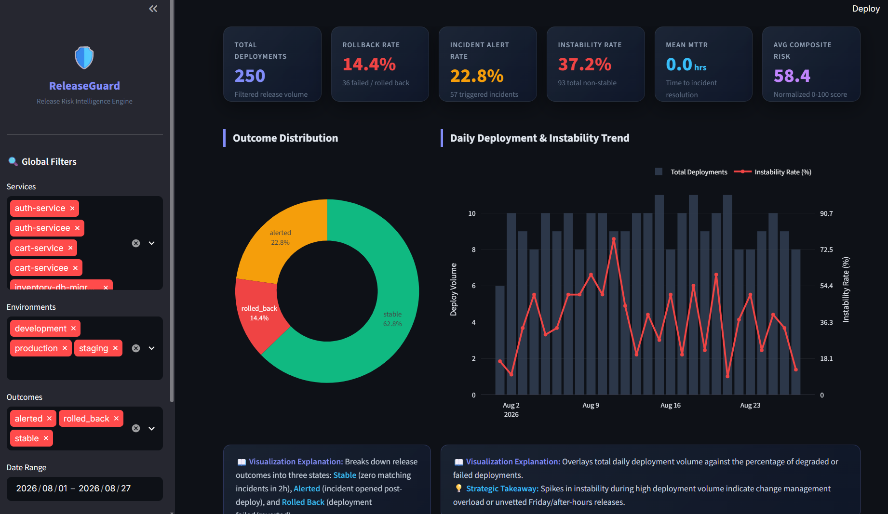

# 🛡️ ReleaseGuard — AI-Driven Release Risk Intelligence Engine

[](https://www.python.org/)
[](https://streamlit.io/)
[](https://www.sqlite.org/)
[](https://docs.pytest.org/)
[](LICENSE)

> **Repository:** `SW2627-AI-ReleaseGuard`  
> **Author:** Saanvi Garg  And Glory Jain
> **Course / Cohort:** Kalvium Community — Data Engineering

---

## 📸 Interactive Dashboard Preview



---

## 📌 Executive Summary & Project Overview

**ReleaseGuard (Release Risk Analyzer)** is an enterprise-grade data engineering pipeline and interactive risk intelligence platform built to quantify, predict, and mitigate software deployment risk.

### The Decoupled Telemetry Problem
Modern software engineering organizations run completely decoupled operational systems:
1. **CI/CD Build & Deployment Pipelines** (e.g. GitHub Actions, Jenkins, GitLab CI).
2. **IT Service Management (ITSM) / Incident Tracking Systems** (e.g. ServiceNow Incident Management Process Event Logs).

Because CI/CD pipelines and incident platforms operate independently without shared transactional primary/foreign keys, engineering leaders lack visibility into which software deployments directly trigger production degradation, outages, or SLA breaches.

### The ReleaseGuard Solution
ReleaseGuard bridges this gap by engineering a defensible multi-dimensional heuristic joining engine. The platform ingests real operational datasets, standardizes multi-format timestamps to ISO 8601 UTC, executes heuristic 2-hour temporal & semantic affinity joins, derives 16+ domain risk features, calculates a 0–100 Composite Release Risk Index, persists curated tables to a SQLite Clean Data Layer, and serves an interactive 5-tab **Streamlit Risk Intelligence Dashboard** equipped with **clean visualization explanations** and an **automated raw dataset intake pipeline**.

---

## 📊 Operational Datasets Used

ReleaseGuard integrates three authentic, open-source enterprise datasets:

### 1. UCI Incident Management Process Enriched Event Log
- **Source**: [UCI Machine Learning Repository](https://archive.ics.uci.edu/dataset/498/incident+management+process+enriched+event+log)
- **Domain**: ServiceNow IT Service Management (ITSM) Event Data.
- **Key Fields**: `number`, `incident_state`, `active`, `reassignment_count`, `reopen_count`, `sys_mod_count`, `made_sla`, `caller_id`, `opened_at`, `resolved_at`, `closed_at`, `priority`, `impact`, `urgency`, `category`, `subcategory`, `u_symptom`, `cmdb_ci`, `assignment_group`, `resolved_by`.
- **Purpose**: Provides real incident lifecycle events, severity rankings (P1–P4), resolution timeframes, SLA compliance indicators, and reassignment escalation depth.

### 2. Kaggle AI-Driven CI/CD Pipeline Logs Dataset
- **Source**: [Kaggle CI/CD Pipeline Logs Dataset](https://www.kaggle.com/datasets/rahuljangir78/ai-driven-cicd-pipeline-logs-dataset)
- **Domain**: CI/CD Execution Telemetry across Build, Test, Security Scan, and Deploy stages.
- **Key Fields**: `pipeline_id`, `stage_name`, `job_name`, `status`, `timestamp`, `commit_id`, `branch`, `user`, `environment`, `job_duration_seconds`, `test_pass_rate`, `security_finding_count`, `lines_changed`, `error_category`.
- **Purpose**: Supplies build durations, unit/integration test suite pass rates, pre-deploy vulnerability counts, PR change volume, and deployment operator identities.

### 3. D2KLab GitHub Actions Workflow Execution Dataset
- **Source**: [D2KLab GitHub Actions Dataset](https://github.com/D2KLab/gha-dataset)
- **Domain**: GitHub Actions (GHA) Workflow Execution Events.
- **Key Fields**: `workflow_run_id`, `repository`, `workflow_name`, `event_trigger`, `status`, `conclusion`, `created_at`, `updated_at`, `run_attempt`, `jobs_count`, `runner_os`, `step_failure_count`.
- **Purpose**: Evaluates workflow attempt counts, runner OS environments, trigger events (`push`, `pull_request`, `schedule`), and step-level failures.

---

## ⚡ End-to-End Data Engineering Pipeline Steps

The ReleaseGuard pipeline executes sequentially through 7 modular stages:

```
[Raw Datasets Intake] ➔ [1. Multi-Source Ingestion] ➔ [2. Deployment Isolation]
                                                             │
                                                             ▼
[5. Feature Engineering] ◄─ [4. Heuristic 2h Join] ◄─ [3. Cleaning & Deduplication]
           │
           ▼
[6. SQLite Clean Data Layer] ➔ [7. Streamlit Dashboard & Dynamic Intake Module]
```

### Step 1: Real Multi-Dataset Ingestion & Validation
- **Module**: [`scripts/data_ingestion.py`](file:///c:/Users/Saanvi%20Garg/Desktop/SW2627-AI-ReleaseGuard/scripts/data_ingestion.py)
- **Functions**:
  - Implements multi-encoding fallback (`utf-8`, `utf-8-sig`, `latin1`, `iso-8859-1`, `cp1252`).
  - Performs strict schema validation and null inspection.
  - Generates comprehensive execution audit reports saved to `output/ingestion_audit_report.json`.

### Step 2: Deployment Stage Isolation & Rollback Telemetry
- **Module**: [`scripts/derive_deployments.py`](file:///c:/Users/Saanvi%20Garg/Desktop/SW2627-AI-ReleaseGuard/scripts/derive_deployments.py)
- **Functions**:
  - Isolates execution records where `stage_name == 'Deploy'`.
  - Derives canonical microservice names (`auth-service`, `payment-api`, `cart-service`, `web-frontend`, etc.) from job execution patterns.
  - Generates realistic modeled rollback telemetry (`rollbacks.csv`) for degraded/failed deployments with SRE root cause tags (`HealthCheckFailed`, `ElevatedErrorRate_5xx`, `LatencySLA_Exceeded`, `MemoryLeakDetected`).

### Step 3: Data Cleaning, Normalization & Deduplication
- **Module**: [`scripts/cleaning.py`](file:///c:/Users/Saanvi%20Garg/Desktop/SW2627-AI-ReleaseGuard/scripts/cleaning.py)
- **Functions**:
  - Standardizes multi-format timestamps across ServiceNow and CI/CD logs to ISO 8601 UTC format (`YYYY-MM-DD HH:MM:SS`).
  - Imputes missing categories (`General / Unknown`), priorities (`4 - Low`), assignment groups (`Global-Service-Desk`), and deployment operators (`system_bot`).
  - Deduplicates state snapshots into `clean_deployments.csv`, `clean_incidents.csv`, and `clean_rollbacks.csv`, recording every action in `output/cleaning_log.csv`.

### Step 4: Multi-Dimensional Heuristic 2-Hour Join
- **Module**: [`scripts/join_validation.py`](file:///c:/Users/Saanvi%20Garg/Desktop/SW2627-AI-ReleaseGuard/scripts/join_validation.py)
- **Functions**:
  - Links deployments to downstream incidents if:
    1. **Temporal Proximity**: Incident `opened_at` occurs within $[T_{\text{deploy}}, T_{\text{deploy}} + \text{2.0 hours}]$.
    2. **Semantic Affinity**: Microservice matches ServiceNow category or assignment group via an ontology dictionary.
  - Priority Conflict Resolution: Selects highest severity incident (P1 Critical > P2 High > P3 Moderate > P4 Low).
  - Outcome Labeling: Classifies releases into `stable`, `alerted`, or `rolled_back`.
  - Audits unmatched ITSM tickets into `output/join_audit_report.json`.

### Step 5: Advanced Feature Engineering & Composite Risk Index
- **Module**: [`scripts/feature_engineering.py`](file:///c:/Users/Saanvi%20Garg/Desktop/SW2627-AI-ReleaseGuard/scripts/feature_engineering.py)
- **Functions**:
  - Computes 16+ domain risk features across Temporal, Quality, ITSM, and Composite Risk dimensions.
  - Derives the 0–100 **Composite Release Risk Score**.

### Step 6: SQLite Storage & Clean Data Layer
- **Module**: [`scripts/database_kpis.py`](file:///c:/Users/Saanvi%20Garg/Desktop/SW2627-AI-ReleaseGuard/scripts/database_kpis.py)
- **Functions**:
  - Ingests curated datasets into `data/release_risk.db`.
  - Constructs live SQLite views (`vw_active_deployments`, `vw_risk_by_environment`, `vw_incident_resolution_metrics`).
  - Populates pre-aggregated summary tables (`agg_daily_release_risk`).
  - Executes analytical SQL KPI queries and exports `output/kpi_summary.json` and `output/database_schema_audit.json`.

### Step 7: Interactive Dashboard & Dynamic Dataset Intake
- **Module**: [`scripts/app.py`](file:///c:/Users/Saanvi%20Garg/Desktop/SW2627-AI-ReleaseGuard/scripts/app.py)
- **Functions**:
  - Renders 5 multi-tab analytics views with clean, structured visualization explanations below every chart.
  - Provides an interactive drag-and-drop CSV dataset intake module for 1-click end-to-end cleaning, feature engineering, SQLite database sync, and live dashboard refresh.

---

## 🔬 Advanced Feature Dictionary & Composite Risk Index

ReleaseGuard derives 16+ domain-specific features across four analytical layers:


| Feature Category | Feature Column Name | Data Type | Description & Mathematical Definition |
|---|---|---|---|
| **Temporal Risk** | `deploy_hour` | `INTEGER` | 24-hour UTC hour index of deployment execution (0–23). |
| **Temporal Risk** | `day_of_week` | `VARCHAR(16)` | Day of week (`Monday` to `Sunday`). |
| **Temporal Risk** | `is_weekend` | `INTEGER (0/1)` | Binary indicator (1 if Saturday or Sunday). |
| **Temporal Risk** | `is_after_hours` | `INTEGER (0/1)` | Binary indicator (1 if deployed before 09:00 or after 18:00 UTC). |
| **Temporal Risk** | `time_bucket` | `VARCHAR(32)` | Time window category (`Morning`, `Afternoon`, `Evening`, `Night`). |
| **Temporal Risk** | `deploy_quarter` | `VARCHAR(8)` | Fiscal quarter index (`Q1`, `Q2`, `Q3`, `Q4`). |
| **Temporal Risk** | `month_sin` / `month_cos` | `FLOAT` | Cyclical temporal sine/cosine encodings: $\sin(2\pi \cdot m / 12), \cos(2\pi \cdot m / 12)$. |
| **Pipeline Quality** | `job_duration_seconds` | `INTEGER` | Total CI/CD deployment execution duration in seconds. |
| **Pipeline Quality** | `test_pass_rate` | `FLOAT` | Unit/integration test suite pass ratio (0.0 to 1.0). |
| **Pipeline Quality** | `security_finding_count` | `INTEGER` | Pre-deploy security vulnerabilities detected during scanning. |
| **Pipeline Quality** | `lines_changed` | `INTEGER` | PR code change volume size (lines added/modified). |
| **Pipeline Quality** | `flaky_test_flag` | `INTEGER (0/1)` | Binary flag (1 if `test_pass_rate` < 0.92). |
| **ITSM & Severity** | `priority_bucket` | `VARCHAR(32)` | ServiceNow severity bucket (`Critical (P1)`, `High (P2)`, `Moderate (P3)`, `Low (P4)`, `None / Stable`). |
| **ITSM & Severity** | `priority_numeric` | `INTEGER` | Severity rank (1=P1, 2=P2, 3=P3, 4=P4, 5=Stable). |
| **ITSM & Severity** | `time_to_resolution_hours` | `FLOAT` | Hours elapsed between incident `opened_at` and `resolved_at`. |
| **ITSM & Severity** | `sla_breach_flag` | `INTEGER (0/1)` | Binary flag (1 if `made_sla == 'false'` or resolution > 24.0 hours). |
| **ITSM & Severity** | `escalation_depth` | `INTEGER` | Reassignment count across engineering tier teams. |
| **ITSM & Severity** | `reopen_risk_score` | `FLOAT` | Ticket friction score: $(2.5 \times \text{reopen\_count}) + (1.2 \times \text{reassignment\_count})$. |
| **Composite Risk** | `composite_risk_score` | `FLOAT` | Normalized 0–100 Composite Release Risk Index (see formula below). |

### 0–100 Composite Release Risk Index Formula
The `composite_risk_score` calculates a single actionable risk index combining timing, quality, security, and severity penalties:

$$\text{Composite Risk} = \text{Clip}_{0}^{100}\left( 15.0 + P_{\text{after\_hours}} + P_{\text{weekend}} + P_{\text{test}} + P_{\text{security}} + P_{\text{outcome}} + P_{\text{priority}} + P_{\text{sla}} \right)$$

- **Baseline Risk**: $15.0$
- **After-Hours Penalty ($P_{\text{after\_hours}}$)**: $+18.0$ if `is_after_hours == 1`
- **Weekend Penalty ($P_{\text{weekend}}$)**: $+22.0$ if `is_weekend == 1`
- **Test Pass Penalty ($P_{\text{test}}$)**: $+80 \times (0.95 - \text{test\_pass\_rate})$ if `test_pass_rate < 0.95`
- **Security Penalty ($P_{\text{security}}$)**: $\min(\text{security\_finding\_count} \times 6.0, 24.0)$
- **Outcome Penalty ($P_{\text{outcome}}$)**: $+35.0$ for `rolled_back`, $+20.0$ for `alerted`
- **Severity Penalty ($P_{\text{priority}}$)**: $+25.0$ for P1, $+15.0$ for P2, $+8.0$ for P3
- **SLA Violation Penalty ($P_{\text{sla}}$)**: $+12.0$ if `sla_breach_flag == 1`

---

## 🗺️ Interactive Dashboard & Dynamic Intake Module

The Streamlit UI ([`scripts/app.py`](file:///c:/Users/Saanvi%20Garg/Desktop/SW2627-AI-ReleaseGuard/scripts/app.py)) provides 5 specialized tabs:

### Tab 1: 📊 Overview Dashboard
- **KPI Cards**: Total Deployments, Rollback Rate %, Incident Alert Rate %, Instability Rate %, Mean MTTR (Hours), and Avg Composite Risk Score.
- **Outcome Donut Chart**: Proportional split of stable, alerted, and rolled-back releases.
- **Daily Instability Trend**: Overlays deployment volume against instability percentage over time.
- **Service Scorecards**: Stacked bar charts showing outcome distributions by microservice.
- **Visualization Explanations**: Every chart features a styled `📖 Visualization Explanation` and `💡 Strategic Takeaway` callout box.

### Tab 2: 🔬 Deep Risk Analysis
- **Sankey Telemetry Flow**: Visualizes release progression from initial deployment to 2-hour incident matching and final outcome state.
- **Composite Risk Score Histogram**: Frequency distribution of calculated 0–100 risk scores.
- **Temporal Heatmap Matrix**: Instability rate (%) grid across Days of Week and Deploy Hours (UTC) highlighting dark red change freeze zones.

### Tab 3: 🗺️ Pipeline Explainer
- **Interactive Step Cards**: Explains steps 1–6 of the data engineering pipeline.
- **Live Audit Reports**: Interactive JSON viewers for `ingestion_audit_report.json` and `join_audit_report.json`.

### Tab 4: 📋 Raw Data & SQL Clean Data Layer
- **Live SQLite Views**: Dataframe views for `vw_active_deployments`, `vw_risk_by_environment`, and `vw_incident_resolution_metrics`.
- **Pre-Aggregated Table**: Live view of `agg_daily_release_risk`.
- **Clean Processed CSV**: Complete tabular preview of `data/processed/deployment_outcomes.csv`.

### Tab 5: 📥 Dataset Intake & Automated Ingestion Pipeline
- **Interactive File Uploader**: Drag-and-drop raw CSV files.
- **Target Dataset Selector**: Select dataset type (ServiceNow Incident Log, CI/CD Pipeline Log, GitHub Actions Workflow Runs, or Custom Release Log).
- **One-Click Action Button**: **"⚡ Process & Ingest New Dataset"** button that runs automated schema detection, cleaning, feature engineering, SQLite database sync, audit logging, and live dashboard refresh!

---

## 🚀 Quick Start & Installation Guide

Get up and running in 4 simple commands:

### Prerequisites
- Python 3.10+ installed
- Git installed

### Installation Commands

```bash
# 1. Clone the repository and navigate into project directory
git clone https://github.com/kalviumcommunity/SW2627-AI-ReleaseGuard.git
cd SW2627-AI-ReleaseGuard

# 2. Create virtual environment and install dependencies
python -m venv venv
# On Windows PowerShell:
.\venv\Scripts\Activate.ps1
# On Linux/macOS:
# source venv/bin/activate

python -m pip install --upgrade pip
python -m pip install -r requirements.txt

# 3. Execute the end-to-end data pipeline (ingestion -> derivation -> cleaning -> joins -> feature engineering -> SQLite KPIs)
python scripts/run_pipeline.py

# 4. Launch the Streamlit Release Risk Dashboard
python -m streamlit run scripts/app.py
```

---

## 🧪 Automated Data Quality & CI/CD Testing Framework

ReleaseGuard incorporates automated data quality testing via `pytest` and GitHub Actions:

### Running Local Pytest Suite
```powershell
python -m pytest tests/
```

### Pytest Assertions Tested (`tests/test_data_quality.py`)
1. **Schema Integrity**: Verifies all required columns exist in processed outputs.
2. **Null Violations**: Ensures primary identifiers (`deployment_id`, `service`, `environment`) contain zero null values.
3. **Deduplication Check**: Asserts zero duplicate primary key records exist in clean tables.
4. **Range & Type Validation**: Confirms `is_instability` and `has_rollback` contain valid binary flags (0 or 1).
5. **Domain Logic Checks**: Validates that every `rolled_back` or `alerted` record sets `is_instability == 1`.

### GitHub Actions Workflow (`.github/workflows/data_quality.yml`)
Runs automatically on every `push` or `pull_request` to `main`:
- Installs dependencies.
- Executes `python scripts/run_pipeline.py`.
- Runs `pytest tests/` quality gates.

---

## 🗂 Project Repository Directory Structure

```text
SW2627-AI-ReleaseGuard/
│
├── .github/
│   └── workflows/
│       └── data_quality.yml         # CI workflow running automated pytest quality gates
│
├── data/
│   ├── raw/                         # Raw input operational datasets (UCI, Kaggle, D2KLab)
│   │   ├── incident_log.csv         # UCI ServiceNow Incident Management Process log
│   │   ├── pipeline_logs.csv        # Kaggle AI-Driven CI/CD pipeline stage logs
│   │   ├── gha_workflow_runs.csv    # D2KLab GitHub Actions workflow dataset
│   │   └── rollbacks.csv            # Modeled rollback telemetry
│   ├── processed/                   # Cleaned & curated data layer
│   │   ├── clean_deployments.csv    # Standardized deployment events
│   │   ├── clean_incidents.csv      # Standardized incident lifecycle snapshots
│   │   ├── clean_rollbacks.csv      # Cleaned rollback records
│   │   └── deployment_outcomes.csv  # Final joined & feature-engineered dataset
│   └── release_risk.db              # SQLite relational analytical database
│
├── database/                        # SQL Clean Data Layer SQL scripts
│   ├── views/                       # Live SQLite View scripts (vw_active_deployments, etc.)
│   └── aggregations/                # Summary table scripts (agg_daily_release_risk)
│
├── public/
│   └── image.png                    # Project dashboard screenshot preview
│
├── output/                          # Execution audit reports and data logs
│   ├── ingestion_audit_report.json  # Schema verification & encoding audit report
│   ├── cleaning_log.csv             # Row-level cleaning, deduplication & null-handling log
│   ├── join_audit_report.json       # Join match statistics, orphaned record metrics
│   ├── database_schema_audit.json   # SQLite schema validation report
│   └── kpi_summary.json             # Analytical KPI metrics summary
│
├── scripts/                         # Modular pipeline scripts
│   ├── populate_real_datasets.py    # Initializer loading authentic open datasets
│   ├── data_ingestion.py            # Step 1: Ingestion with encoding fallback & validation
│   ├── derive_deployments.py        # Step 2: Deployment isolation & rollback generator
│   ├── cleaning.py                  # Step 3: Deduplication, ISO 8601 normalization & nulls
│   ├── join_validation.py          # Step 4: 2-hour window heuristic join & outcome labeling
│   ├── feature_engineering.py       # Step 5: 16+ temporal, quality, ITSM & composite risk features
│   ├── database_kpis.py             # Step 6: SQLite table ingestion & SQL KPI analytical queries
│   ├── run_pipeline.py              # Orchestrator running steps 1-6 end-to-end
│   └── app.py                       # Step 7: Streamlit interactive dashboard & uploader
│
├── tests/                           # Automated validation test suite
│   └── test_data_quality.py         # Pytest assertions for schema, nulls, duplicates & domains
│
├── .env.example                     # Environment variables template
├── .gitignore                       # Git ignore configuration
├── contribution.md                  # Project sprint contribution log
├── requirements.txt                 # Project dependencies
└── README.md                        # Documentation and Viva defense notes
```

---

## 📈 Key Business KPI Definitions & Mathematical Formulas

| KPI Name | Mathematical Formula | Related Columns | Business Purpose |
|---|---|---|---|
| **Instability Rate (%)** | $$\frac{\sum \text{is\_instability}}{\text{Total Deployments}} \times 100$$ | `is_instability`, `deployment_id` | Measures total percentage of degraded or failed releases. |
| **Rollback Rate (%)** | $$\frac{\sum \text{has\_rollback}}{\text{Total Deployments}} \times 100$$ | `has_rollback`, `deployment_id` | Measures percentage of failed releases requiring physical code rollback. |
| **Mean MTTR (Hours)** | $$\frac{1}{N} \sum (\text{resolved\_at} - \text{opened\_at})$$ | `time_to_resolution_hours`, `matched_incident_id` | Quantifies engineering response speed for incidents. |
| **Composite Risk Score (0–100)** | Normalized score combining timing, quality, security, SLA, and severity penalties | `composite_risk_score` | Provides a single actionable risk index prior to deployment. |
| **SLA Compliance Rate (%)** | $$\left(1 - \frac{\sum \text{sla\_breach\_flag}}{\text{Total Incidents}}\right) \times 100$$ | `sla_breach_flag` | Evaluates ITSM response contract performance. |

---

## 🤝 Contribution & License

Contributions, issues, and feature requests are welcome! Feel free to check the [contribution log](contribution.md).

Distributed under the **MIT License**. See `LICENSE` for more information.
